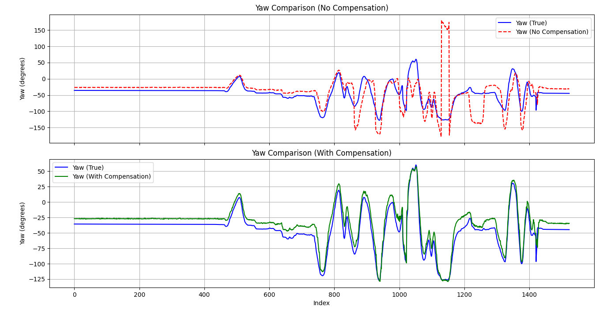
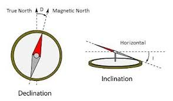

# Heading Tilt Compensation

## Abstract
Determining the **heading** (or **yaw**) of a device is typically accomplished using a **magnetometer**, a three-axis sensor that detects the direction of the Earth's **magnetic north**. While the underlying principle is straightforward, interpreting magnetometer data becomes challenging when the device is rotated arbitrarily in three dimensions.

To obtain accurate heading measurements, magnetometer readings are combined with data from an **accelerometer**. This process, known as **heading tilt compensation**, utilizes the **gravity vector** provided by the accelerometer to correct for tilts and rotations that would otherwise compromise heading accuracy. The gravity vector enables alignment of the magnetometer's output with the true horizontal plane, thereby enhancing reliability.

This repository provides a step-by-step guide for calculating the correct heading, ultimately yielding the device's **attitude**—comprising **roll**, **pitch**, and **yaw**.

## Description

### Simple Heading Calculation (Sensor is Leveled)
A **magnetometer** measures the strength and direction of magnetic fields, including the Earth's magnetic north, allowing devices to determine their orientation. The sensor's output vector is defined as:

$$
M =
\begin{bmatrix}
m_x \\
m_y \\
m_z
\end{bmatrix}
$$

When the sensor is level, calculating the **heading** (yaw) is straightforward. The magnetometer output in this scenario is:

$$
M_\text{level} =
\begin{bmatrix}
m_x' \\
m_y' \\
m_z'
\end{bmatrix}
$$

The heading is then given by:

$$
\gamma = \text{heading} = \arctan2(m_y', m_x')
$$

When the magnetometer is level and aligned with the Earth's magnetic north, the output vector is:

$$
M_0 =
\begin{bmatrix}
B\cos\delta \\
0 \\
B\sin\delta
\end{bmatrix}
$$

where $\delta$ is the inclination angle of the Earth's magnetic field, and $B$ is the magnitude of the Earth's magnetic field vector. This indicates that the magnetic force points not only northward but also downward due to the Earth's field inclination. However, when the device is tilted, the magnetometer axes no longer align with the Earth's horizontal plane, introducing errors in heading calculation. This misalignment arises because the sensor's coordinate system diverges from the world-frame or **NED** (North-East-Down) coordinate system.

### Tilt Calculation
An accelerometer senses acceleration forces, including gravity, and outputs a three-dimensional vector:

$$
G =
\begin{bmatrix}
a_x \\
a_y \\
a_z
\end{bmatrix}
$$

When stationary, the accelerometer primarily reflects the direction of the gravity vector. For a level sensor, the output is:

$$
G_0 =
\begin{bmatrix}
0 \\
0 \\
g
\end{bmatrix}
$$

where $g$ is the acceleration due to gravity (approximately $9.81\,\text{m/s}^2$ on Earth).

By analyzing the accelerometer vector components, the roll and pitch angles can be determined.

#### Roll Calculation

The **roll** angle (rotation about the X-axis) is calculated as:

```math
\alpha = \text{roll} = \arctan2(a_y, a_z)
```

- $`a_y`$: acceleration along the Y-axis
- $`a_z`$: acceleration along the Z-axis

The `arctan2` function ensures the angle is computed correctly, even if the device is inverted.

#### Pitch Calculation

The **pitch** angle (rotation about the Y-axis) is calculated as:

```math
\beta = \text{pitch} = \arctan2(-a_x, \sqrt{a_y^2 + a_z^2})
```

- $`a_x`$: acceleration along the X-axis
- The denominator accounts for tilt using the Y and Z components

<!-- This method maintains accuracy regardless of device orientation. -->

### Heading Tilt Compensation

Accurate orientation in three-dimensional space requires determining the **roll** and **pitch** angles, which describe rotation about the device's X and Y axes, respectively. The **gravity vector** measured by the accelerometer serves as a stable reference for these calculations. By knowing the sensor's rotation in 3D space, it is possible to "derotate" the magnetometer vector to align with the NED coordinate system, effectively leveling it.

$$
M = R M_0
$$

where $R$ is the rotation matrix describing the sensor's orientation in 3D space:

$$
R = R_x(\alpha) R_y(\beta) R_z(\gamma)
$$

with $\alpha$, $\beta$, and $\gamma` representing roll, pitch, and yaw, respectively. By determining the roll and pitch values, their effects on the magnetometer output vector $M$ can be eliminated:

$$
R_y(-\beta) R_x(-\alpha) M =  R_z(\gamma) M_0 = M_\text{level}
$$

## Results

To evaluate the effectiveness of heading tilt compensation, we utilized a dataset containing measurements from an **IMU** (Inertial Measurement Unit) with accurate **roll**, **pitch**, and **yaw** values, which were considered as the reference. The dataset also included readings from a **magnetometer**. The comparison was conducted to analyze the difference between the heading calculated with and without tilt compensation.

The results demonstrate that without tilt compensation, the heading deviates significantly when the device is tilted, leading to inaccurate orientation measurements. In contrast, applying tilt compensation aligns the magnetometer readings with the true horizontal plane, resulting in a heading that closely matches the reference values.

<div align="center">
  
  <p><em>Figure: Comparison of heading with and without tilt compensation.</em></p>
</div>

## Appendix

### Inclination and Declination

The Earth's magnetic field is not uniform and varies depending on the location. Two important parameters that describe the Earth's magnetic field are **inclination** and **declination**. The following image shows an overview of these concepts.

<div align="center">
  
  <p><em>Figure: Overview of Earth's magnetic field showing inclination and declination.</em></p>
</div>

#### Magnetic Declination
Magnetic declination is the angle between **true north** (geographic north) and **magnetic north**. It varies depending on your position on the Earth's surface. A positive declination indicates that magnetic north is east of true north, while a negative declination means it is west of true north.

The diagram below illustrates magnetic declination:

<div align="center">
  
  <p><em>Figure: Magnetic Declination.</em></p>
</div>

#### Magnetic Inclination
Magnetic inclination, also known as the **dip angle**, is the angle between the horizontal plane and the Earth's magnetic field lines. At the magnetic equator, the inclination is 0°, while at the magnetic poles, it is ±90° (pointing straight down or up).

The diagram below illustrates magnetic inclination:

<div align="center">
  
  <p><em>Figure: Magnetic Inclination.</em></p>
</div>

### Importance in Heading Calculations
Both inclination and declination affect the accuracy of heading calculations. Declination must be accounted for to align the magnetometer's readings with true north, while inclination impacts the tilt compensation process, as the Earth's magnetic field vector is not purely horizontal.

By understanding and compensating for these parameters, accurate heading measurements can be achieved, even in regions with significant magnetic anomalies.
